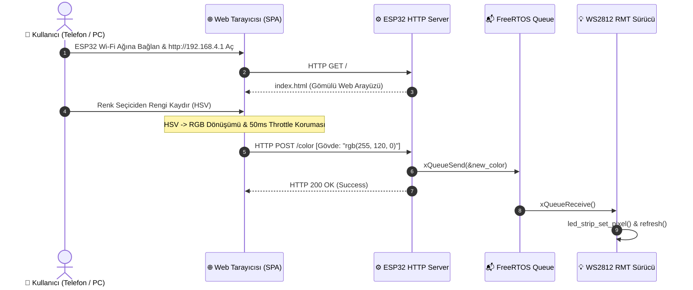

# ESP32-C6 Wi-Fi SoftAP HSV Web LED Kontrolcüsü

Bu proje; **ESP32-C6** mikrodenetleyicisi üzerinde harici bir modeme ihtiyaç duymadan kendi Wi-Fi erişim noktasını (**SoftAP**) oluşturan, dahili flash belleğine gömülü modern bir web arayüzü sunan ve tarayıcı üzerinden dokunmatik/fare ile **HSV (Hue, Saturation, Value)** renk uzayında adreslenebilir RGB LED (WS2812 / NeoPixel) kontrolü sağlayan gömülü bir web sunucusudur.

---

## 📑 İçindekiler
1. [Sistem Mimarisi ve Çalışma Mantığı](#-sistem-mimarisi-ve-çalışma-mantığı)
2. [Öne Çıkan Özellikler ve Mühendislik Detayları](#-öne-çıkan-özellikler-ve-mühendislik-detayları)
   - [Gömülü HTML Dosya Yapısı (Binary Embedding)](#1-gömülü-html-dosya-yapısı-binary-embedding)
   - [HSV Renk Uzayı ve CSS Katmanlama Sihri](#2-hsv-renk-uzayı-ve-css-katmanlama-sihri)
   - [50ms İstemci Koruması (Throttling / Debouncing)](#3-50ms-istemci-koruması-throttling--debouncing)
3. [HTTP REST API Uç Noktaları](#-http-rest-api-uç-noktaları)
4. [Donanım Bağlantıları ve Pinout](#-donanım-bağlantıları-ve-pinout)
5. [Wi-Fi Ağ Ayarlarını Düzenleme](#-wi-fi-ağ-ayarlarını-düzenleme)
6. [Derleme, Flaşlama ve Kullanım Kılavuzu](#-derleme-flaşlama-ve-kullanım-kılavuzu)

---

## 🌐 Sistem Mimarisi ve Çalışma Mantığı



---

## ⚡️ Öne Çıkan Özellikler ve Mühendislik Detayları

### 1. Gömülü HTML Dosya Yapısı (Binary Embedding)
Web arayüzü harici bir SD kart veya SPIFFS/LittleFS dosya sistemi gerektirmez. `CMakeLists.txt` içerisindeki `EMBED_TXTFILES "index.html"` yönergesi sayesinde HTML/CSS/JS kodları derleme anında doğrudan ESP32'nin flash kod alanına gömülür:
- Cihaz sıfır gecikmeyle web sayfasını sunar.
- Dosya sistemi bozulma veya mount hataları tamamen ortadan kalkar.

### 2. HSV Renk Uzayı ve CSS Katmanlama Sihri
İnsan gözünün renk ve parlaklık algısına en uygun olan **HSV (Hue - Ton, Saturation - Doygunluk, Value/Brightness - Parlaklık)** renk uzayı kullanılmıştır:
- **2D Sol Kare (Doygunluk ve Parlaklık)**: Üst üste binen 3 farklı CSS katmanı (altta dinamik saf renk, ortada beyazdan saydama yatay gradyan, üstte siyahtan saydama dikey gradyan) ile tam pürüzsüz bir renk matrisi oluşturur. Böylece saf renkler, ara tonlar, tam beyaz ve tam siyah kusursuz seçilebilir.
- **1D Sağ Çubuk (Ton/Hue)**: $0^\circ$ ile $360^\circ$ arasındaki renk tayfını dikey olarak sunar.
- **Tarayıcı Tabanlı Hesaplama**: HSV'den standart RGB ($0-255$) değerlerine dönüşüm kullanıcının telefonunda/bilgisayarında JavaScript ile yapılır; mikrodenetleyiciye sadece hazır `rgb(r,g,b)` paketi iletilir.

### 3. 50ms İstemci Koruması (Throttling / Debouncing)
Dokunmatik ekranda parmak kaydırıldığında tarayıcı saniyede 100'den fazla hareket olayı üretir. Bu durumun ESP32'nin ağ yığınını boğmasını ve bellek aşımını (Memory Overflow) önlemek için JavaScript tarafında **50 ms sınırlaması** uygulanmıştır. Saniyede maksimum 20 paket gönderilerek hem akıcı tepki süresi hem de tam donanım kararlılığı sağlanır.

---

## 📡 HTTP REST API Uç Noktaları

| Yöntem (Method) | URI Yolu | İçerik Tipi | Açıklama |
| :--- | :--- | :--- | :--- |
| **GET** | `/` | `text/html` | Gömülü HTML5/CSS3/JS Web Arayüzünü döner |
| **POST** | `/color` | `text/plain` | Seçilen RGB rengini ayarlar (Örnek gövde: `rgb(0,255,200)`) |

---

## 🔌 Donanım Bağlantıları ve Pinout

| Çevre Birimi | ESP32-C6 Pini | Açıklama |
| :--- | :--- | :--- |
| **WS2812 RGB LED (DI)** | `GPIO 8` | Dahili RGB LED veya harici şerit LED veri pini |
| **Besleme (VCC)** | `5V` / `3.3V` | LED şeridi besleme pini |
| **Toprak (GND)** | `GND` | Ortak toprak hattı |

---

## 🔑 Wi-Fi Ağ Ayarlarını Düzenleme

`main/wifi_led.c` dosyasındaki tanımları kendi tercihinize göre düzenleyebilirsiniz:

```c
#define WIFI_SSID       "YOUR_WIFI_SSID"       // Örn: "ESP32_LED_PANEL"
#define WIFI_PASS       "YOUR_WIFI_PASSWORD"   // Örn: "12345678" (Şifresiz açık ağ için "" bırakın)
#define WIFI_CHANNEL    1                      // Wi-Fi Kanalı (1-13)
#define MAX_CONNECTIONS 4                      // Eşzamanlı bağlanabilecek maksimum cihaz sayısı
```

---

## 🚀 Derleme, Flaşlama ve Kullanım Kılavuzu

1. **ESP-IDF Ortamını Etkinleştirin:**
   ```bash
   . $HOME/esp/esp-idf/export.sh
   ```

2. **Hedef Çipi Seçin:**
   ```bash
   idf.py set-target esp32c6
   ```

3. **Derleyin ve Flaşlayın:**
   ```bash
   idf.py build
   idf.py -p /dev/tty.usbserial-XXXX flash monitor
   ```

4. **Kullanım:**
   - Telefonunuzdan veya bilgisayarınızdan Wi-Fi ayarlarına girin.
   - `YOUR_WIFI_SSID` isimli ağa bağlanın (Şifre belirlediyseniz girin).
   - Tarayıcınızı açıp `http://192.168.4.1` adresine gidin.
   - Renk panelinden istediğiniz rengi seçin ve açma/kapatma anahtarı ile LED'inizi yönetin!

---

## 📄 Lisans
Bu proje açık kaynaklıdır.
